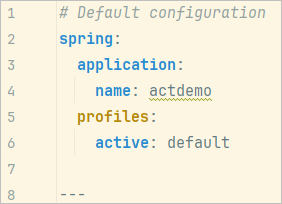
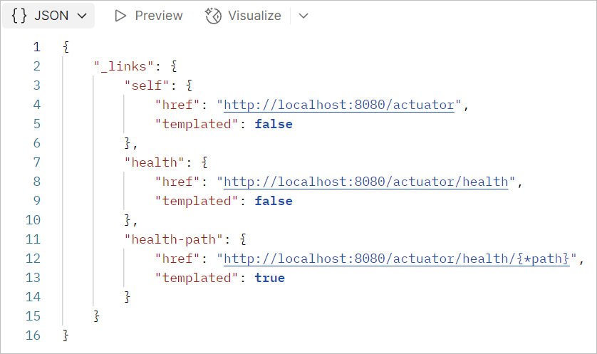
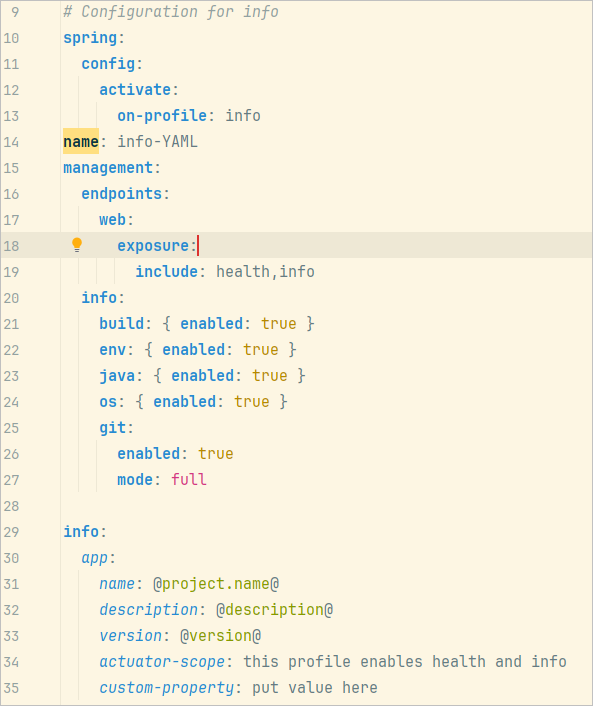
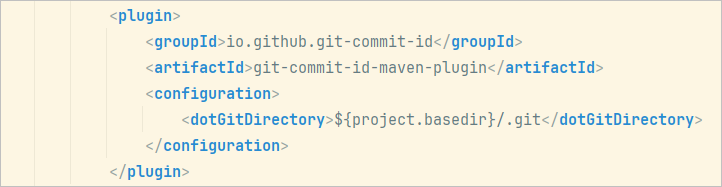

# Spring Boot Actuator
Developed in the WebApi sandbox, an area for proof-of-concept ideas for future ideas for Atlas/WebAPI.  Branch: `actuator-demo`.

Setup: 

* Generate Spring Boot project with `initializr`.  Include Spring Boot starter web and the actuator.  Select Maven and latest Spring Boot version.

```xml
<dependency>
	<groupId>org.springframework.boot</groupId>
	<artifactId>spring-boot-starter-actuator</artifactId>
</dependency>

```

This baseline really won't provide much useful information.   Here's the default profile (note we are using YAML properties format):



Use `/actuator` from Postman and you see that only `/health` and `/info` are enabled:



Let's add more capability.  Here's the "info" profile:



If we look at the `management` section, we can see that the `health` and `info` endpoints are exposed.  Then there is additional configuration for the `info` endpoint: we want build, environment, java, os, and git information to be displayed.  Note that the git function will require including a plugin:



To get the git/build information you will need to run a maven compile, i.e. something like `mvn clean package`.  This creates special output in the `target` folder.  Unfortunately when compiling from IntelliJ it wipes out `target` and does not regenerate the git/build info.  There's probably a setting or special command, need to dig into it further.

Next we define a new profile (info) in our YAML properties file and make it the active profile via  `profiles:active:info`:


Executing `actuator/info` now provides a lot of detail:

```
{
    "app": {
        "name": "actdemo",
        "description": "Actuator demo project for OHDSI WebAPI Sandbox",
        "version": "0.0.1-SNAPSHOT",
        "actuator-scope": "this profile enables health and info",
        "custom-property": "put value here"
    },
    "git": {
        "local": {
            "branch": {
                "ahead": "0",
                "behind": "0"
            }
        },
        "commit": {
            "id": {
                "describe-short": "be5f2fd-dirty",
                "abbrev": "be5f2fd",
                "full": "be5f2fdeb5c960067a8ca3dfc010770c8bb8a47e",
                "describe": "be5f2fd-dirty"
            },
            "message": {
                "short": "info endpoint",
                "full": "info endpoint"
            },
            "user": {
                "name": "David Mishler",
                "email": "profmish@gmail.com"
            },
            "author": {
                "time": "2025-07-17T17:01:08-04:00"
            },
            "committer": {
                "time": "2025-07-17T17:01:08-04:00"
            },
            "time": "2025-07-17T21:01:08Z"
        },
        "branch": "actuator-demo",
        "build": {
            "time": "2025-07-22T15:06:07Z",
            "version": "0.0.1-SNAPSHOT",
            "host": "mish_p6",
            "user": {
                "name": "David Mishler",
                "email": "profmish@gmail.com"
            }
        },
        "tag": "",
        "tags": "",
        "total": {
            "commit": {
                "count": "8"
            }
        },
        "closest": {
            "tag": {
                "commit": {
                    "count": ""
                },
                "name": ""
            }
        },
        "remote": {
            "origin": {
                "url": "https://github.com/OHDSI/AtlasWebAPISandbox.git"
            }
        },
        "dirty": "true"
    },
    "java": {
        "version": "21.0.6",
        "vendor": {
            "name": "Eclipse Adoptium",
            "version": "Temurin-21.0.6+7"
        },
        "runtime": {
            "name": "OpenJDK Runtime Environment",
            "version": "21.0.6+7-LTS"
        },
        "jvm": {
            "name": "OpenJDK 64-Bit Server VM",
            "vendor": "Eclipse Adoptium",
            "version": "21.0.6+7-LTS"
        }
    },
    "os": {
        "name": "Windows 11",
        "version": "10.0",
        "arch": "amd64"
    }
}
```

Finally we can define the "all" configuration which exposes all actuator endpoints.  I copied the info endpoint and then edited the `exposure` property, setting it to "*".  After making the all profile active, the following information endpoints are exposed:

* auditevents (requires an `AuditEventRepository` bean)
* beans
* caches
* conditions
* configprops
* env
* flyway (requires one or more `Flyway` beans)
* health
* httpexchanges (requires an `HttpExchangeRepository` bean)
* info
* integrationgraph (Requires a dependency of `spring-integration-core`)
* loggers
* liquibase (requires one or more `Liquibase` beans)
* metrics
* mappings
* quartz
* scheduledtasks
* sessions
* shutdown
* startup (Requires the `SpringApplication` to be configured with a `BufferingApplicationStartup`)
* threaddump

Finally note that enabling Spring security will restrict the actuator endpoints, requiring that you add a "permit all" actuator security configuration.
